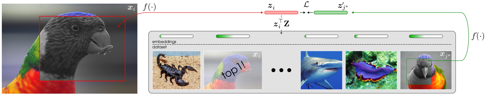

# AdaSim
[[`arXiv`](https://arxiv.org/abs/2303.13606)]

This repo contains the Pytorch implementation of our ICCV 2023 paper:
> [**Adaptive Similarity Bootstrapping for Self-Distillation based Representation Learning**](https://arxiv.org/pdf/2303.13245.pdf)
>
> [Tim Lebailly*](https://www.timlebailly.com/), [Thomas Stegmüller*](https://people.epfl.ch/thomas.stegmuller?lang=en), [Behzad Bozorgtabar](https://behzadbozorgtabar.com/), [Tinne Tuytelaars](https://homes.esat.kuleuven.be/~tuytelaa/), and [Jean-Philippe Thiran](https://people.epfl.ch/jean-philippe.thiran).




## Dependencies
Our code only has a few dependencies. First, install PyTorch for your machine following [https://pytorch.org/get-started/locally/](https://pytorch.org/get-started/locally/).
Then, install other needed dependencies:
```bash
pip install einops
```

## Pretraining
### Single GPU pretraining
Run the [main_adasim.py](main_adasim.py) file. Command line args are defined in [parser.py](adasim_utils/parser.py).
```bash
python main_adasim.py --args1 val1
```

**Make sure to use the right arguments specified in the table below!**

### 1 node pretraining
```bash
python -m torch.distributed.launch --nproc_per_node=8 main_adasim.py --args1 val1
```

## Citation
If you find our work useful, please consider citing:

```
@article{lebailly2023adaptive,
  title={Adaptive Similarity Bootstrapping for Self-Distillation},
  author={Lebailly, Tim and Stegm{\"u}ller, Thomas and Bozorgtabar, Behzad and Thiran, Jean-Philippe and Tuytelaars, Tinne},
  journal={arXiv preprint arXiv:2303.13606},
  year={2023}
}
```

## Acknowledgments

This code is adapted from [DINO](https://github.com/facebookresearch/dino).
